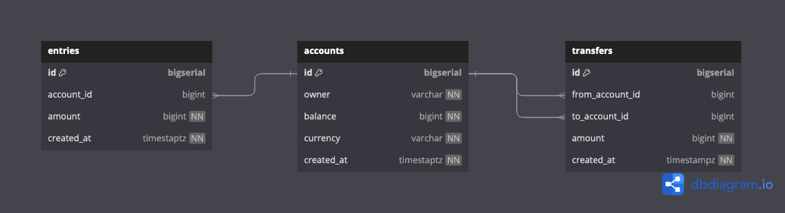

# The Best Bank!
A backend-heavy project of the best bank I could come up with! 

The DB schema for this project:


To start the container you can use:
```bash
make postgres
```

To create the database you can use:
```bash
make createdb
```

To drop the database you can use:
```bash
make dropdb
```

To run migrations you can use:
```bash
make migrateup
```
To run migration down you can use:
```bash
make migratedown
```

